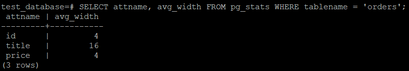

# Домашнее задание к занятию "6.4. PostgreSQL"
1. Управляющие команды:
   Команда | Действие
   ------- | --------
   \l | вывод списка БД
   \c | подключение к БД
   \dt | вывод списка таблиц
   \d [имя таблицы] | вывод описания содержимого таблиц
   \q | выход из psql
2. Столбец таблицы "orders" с наибольшим средним значением размера элементов в байтах: ```title```.  
   
3. В качестве решения предлагаю использовать следующую транзакцию:
   ```
   BEGIN;
   ALTER TABLE orders RENAME TO orders_old;
   CREATE TABLE orders (LIKE orders_old) PARTITION BY RANGE (price);
   CREATE TABLE orders_1 PARTITION OF orders FOR VALUES FROM ('499') TO (MAXVALUE);
   CREATE TABLE orders_2 PARTITION OF orders FOR VALUES FROM (MINVALUE) TO (499);
   INSERT INTO orders SELECT * FROM orders_old;
   DROP TABLE orders_old;
   COMMIT;
   ```
   Информация о таблице orders после выполнения транзакции:  
   
4. Бекап базы можно найти [здесь](./backup/dump_test_database.sql).  
   Файл бекапа по сути представляет из себя набор SQL команд для воссоздания таблиц. Чтобы добавить уникальность значения столбца ```title```  достаточно изменить соответствующую команду в бекапе базы.   
   Например:  
   было
   ```
   CREATE TABLE public.orders (
      id integer NOT NULL,
      title character varying(80) NOT NULL,
      price integer
   )
   PARTITION BY RANGE (price);
   ```
   стало
   ```
   CREATE TABLE public.orders (
      id integer NOT NULL,
      title character varying(80) UNIQUE NOT NULL,
      price integer
   )
   PARTITION BY RANGE (price);
   ```
   